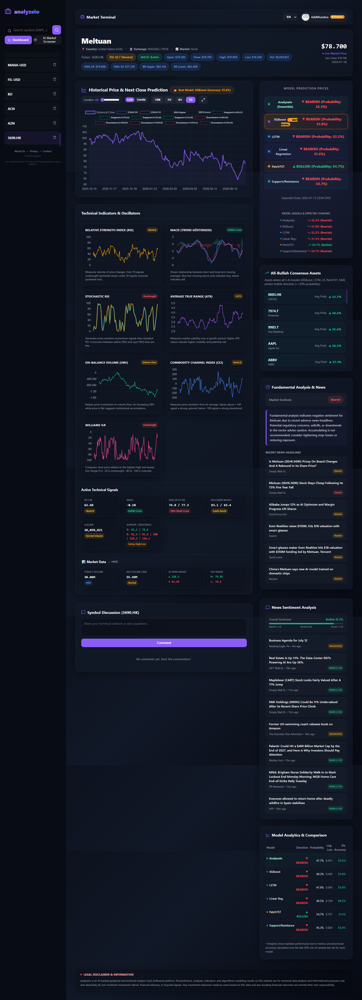
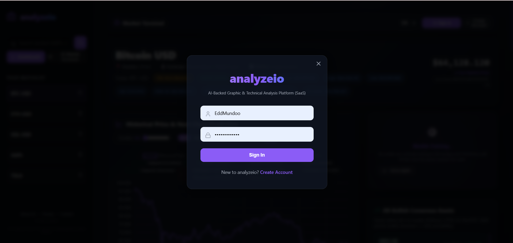
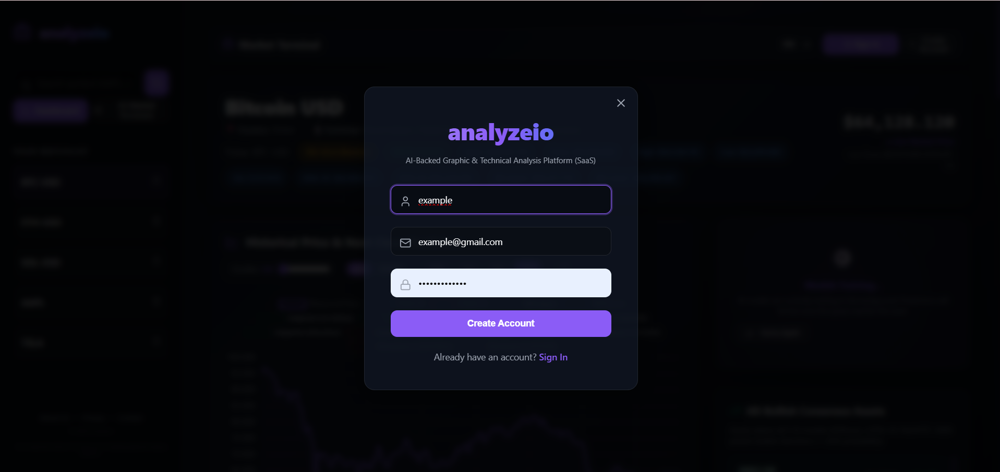
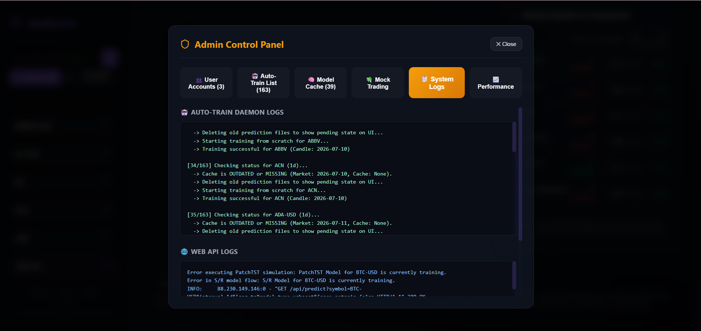
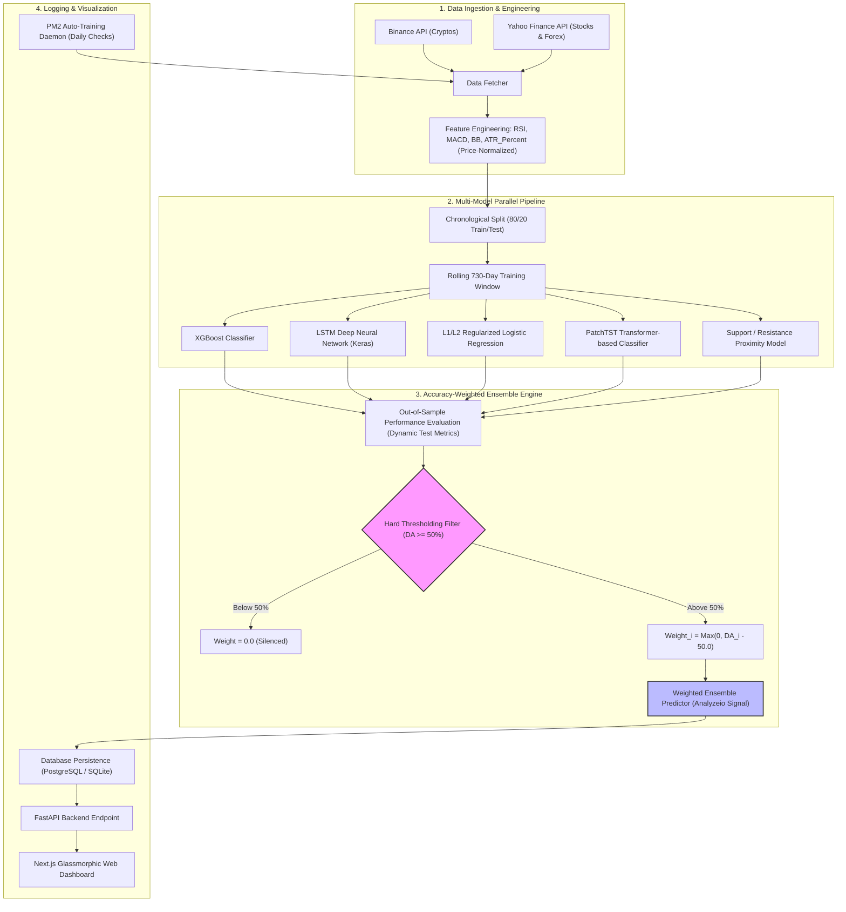

# Analyzeio 📈
> **Advanced AI-Powered Multi-Model Crypto & Stock Forecasting Dashboard**

🔗 **Live Website:** [analyze-io.com](https://analyze-io.com)

Analyzeio is an end-to-end quantitative forecasting platform that downloads real-time financial market data, engineers robust technical indicators, trains five distinct machine learning models in parallel, and combines their forecasts using a custom **Accuracy-Weighted Ensemble with Hard Thresholding**. 

The platform features a modern, glassmorphic Next.js web interface alongside an automated, background training daemon orchestrated via PM2.
---

## 📷 Screenshots & UI Walkthrough

### 🖥️ Main Dashboard Interface

*The main user interface featuring real-time interactive technical analysis charts (Chart.js), dynamic asset selection lists, and active model prediction indicators.*

### 🔑 Authentication Screens
| 🔐 Sign In | 📝 Register |
|---|---|
|  |  |
| *Secure user authentication panel utilizing bcrypt hashing.* | *Registration portal to create new user profiles.* |

### 📈 Admin Control Modal & Performance Analytics


*Secure admin panel showing out-of-sample directional accuracy statistics, dynamic filters (All, Correct, Wrong, Bullish, Bearish), search filters, and prediction execution status logs.*

---

## 🛠️ System Architecture

The following diagram illustrates the flow of data from ingestion to model training, evaluation, voting, and database logging:



---

## 🧠 Algorithmic Core: Hard-Thresholded Ensemble

Instead of relying on a single estimator or a naive simple average (which often suffers from performance degradation due to underperforming classifiers), Analyzeio implements a **Hard-Thresholded, Accuracy-Weighted Ensemble voting system**.

### 1. Model Selection & Silencing
For each model $i \in \{\text{XGBoost, LSTM, LR, PatchTST, S/R}\}$, we evaluate its out-of-sample directional accuracy ($\text{DA}_i$) on the test set. Models that perform worse than a random guess (write-a-coin flip baseline of 50.0%) are completely excluded from voting:

$$w_i = \begin{cases} \max(0.0, \text{DA}_i - 50.0) & \text{if } \text{DA}_i \ge 50.0 \\ 0.0 & \text{if } \text{DA}_i < 50.0 \end{cases}$$

### 2. Weighted Ensemble Prediction
The final directional probability $P_{\text{Ensemble}}$ for the next candle close is calculated as:

$$P_{\text{Ensemble}} = \frac{\sum_{i} \left(w_i \cdot P_i\right)}{\sum_{i} w_i}$$

*Note: In the rare edge case where all individual models score below 50.0%, the engine gracefully falls back to an equal-weighted average ($w_i = 1.0$) to maintain operational continuity.*

---

## ✨ Features

- **🚀 Live Multi-Model Training**: Parallel pipeline running XGBoost, LSTM, Logistic Regression, PatchTST, and Support/Resistance models.
- **🛡️ Out-of-Sample Performance Guard**: Automatically silences underperforming models dynamically per asset.
- **⚡ Price-Normalized Stationarity**: Uses custom feature scaling (`ATR_Percent` relative to close price) to ensure consistent scale-invariant training features.
- **📅 PM2 Automated Daemon**: Background python daemon (`crypto_daemon.py`) that monitors live markets, retrains models daily, and manages a mock-trading simulation.
- **🔒 Secure Admin Dashboard modal**: Secure panel for admins to search assets, inspect individual out-of-sample metrics, and analyze ensemble performance logs.
- **💎 Premium glassmorphism UI**: High-fidelity dashboard built with Next.js and Chart.js, featuring dark mode, animations, and fully interactive market charts.

---

## 💻 Tech Stack

- **Backend**: Python 3.12, FastAPI, SQLAlchemy, PostgreSQL/SQLite, PM2
- **Machine Learning**: TensorFlow (Keras), Scikit-Learn, XGBoost, Pandas, Numpy, YFinance
- **Frontend**: JavaScript, Next.js 14, CSS (Vanilla Custom Styles), Chart.js
- **DevOps/Deployment**: Linux VPS, Git, GitHub, PM2 process management

---

## 📂 Project Structure

```
├── backend/
│   ├── main.py                    # FastAPI entrypoint
│   ├── config.py                  # Default parameters, constants, database URLs
│   ├── database.py                # SQLAlchemy schemas and database connections
│   ├── data_fetcher.py            # Financial data ingestion & feature engineering
│   ├── predictor.py               # Main prediction pipeline and ensemble logic
│   ├── prediction_engine.py       # ML evaluation metrics (DA, logloss, train utilities)
│   ├── routes_admin.py            # Admin API endpoints
│   ├── crypto_daemon.py           # Automated background training loop scheduler
│   ├── mock_trading.py            # Mock-trading simulation module
│   ├── model_lstm_handler.py      # LSTM train/predict wrapper
│   ├── model_xgb_handler.py       # XGBoost train/predict wrapper
│   ├── model_lr_handler.py        # Logistic Regression train/predict wrapper
│   ├── model_patchtst_handler.py  # PatchTST classifier train/predict wrapper
│   └── model_sr_handler.py        # Support/Resistance classifier wrapper
│
├── frontend/
│   ├── src/app/
│   │   ├── page.js                # Core dashboard landing page
│   │   ├── translations.js        # Multi-language translations dictionary
│   │   └── layout.js              # Next.js main layout wrapper
│   └── package.json
│
├── scratch/
│   ├── test_optimized_pipeline.py # Local integration testing script
│   └── compare_seq_lengths.py     # Backtesting comparison research script
│
├── requirements.txt               # Backend dependencies
└── README.md                      # Documentation
```

---

## 🚀 Quickstart

### 1. Clone & Set Up Backend
```bash
# Clone the repository
git clone https://github.com/your-username/analyzeio.git
cd analyzeio

# Create a virtual environment
python -m venv venv
source venv/bin/activate  # On Windows: venv\Scripts\activate

# Install dependencies
pip install -r requirements.txt
```

### 2. Run Database Migrations & Initial Predictions
```bash
# Set PYTHONPATH and run a test prediction for BTC-USD
$env:PYTHONPATH="." # On Linux: export PYTHONPATH="."
python scratch/test_optimized_pipeline.py
```

### 3. Run FastAPI Backend Server
```bash
uvicorn backend.main:app --host 127.0.0.1 --port 8000 --reload
```

### 4. Start Next.js Frontend Dev Server
```bash
cd frontend
npm install
npm run dev
```
Open `http://localhost:3000` to view the dashboard!
